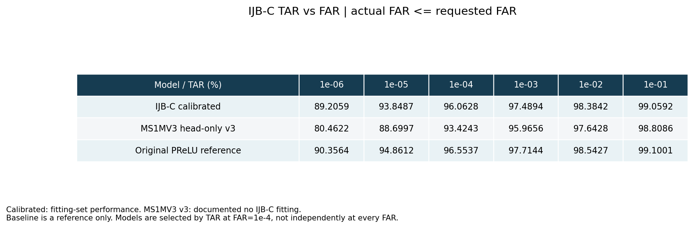
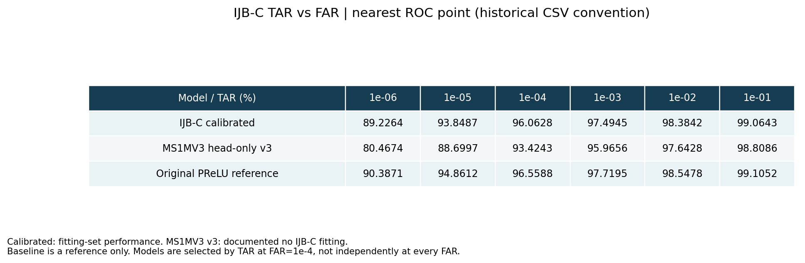
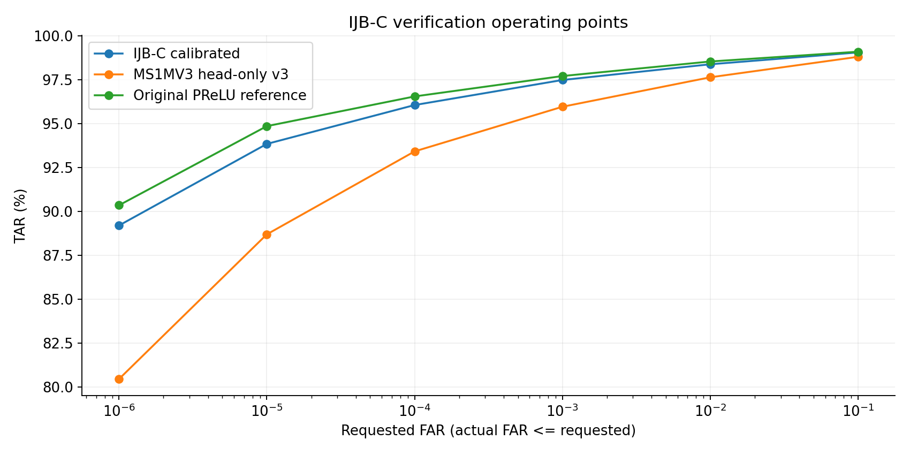
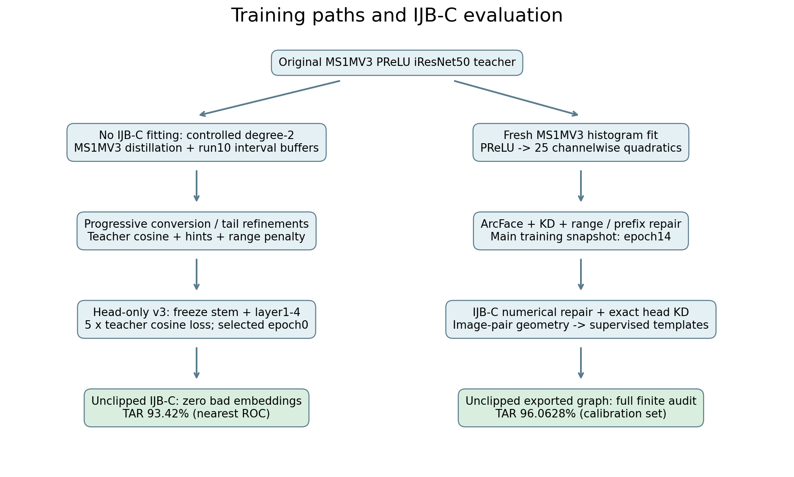
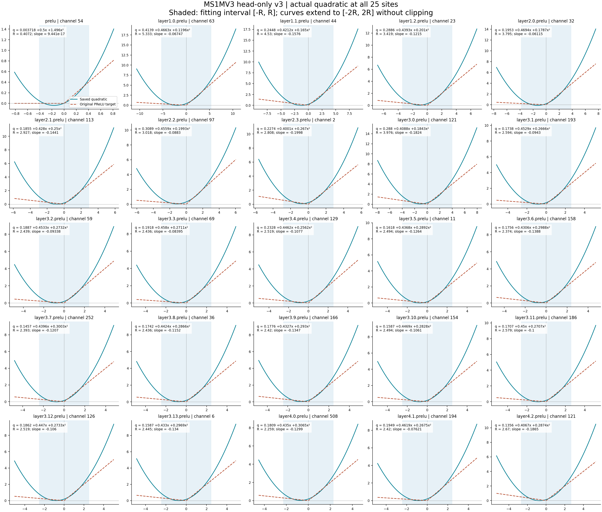
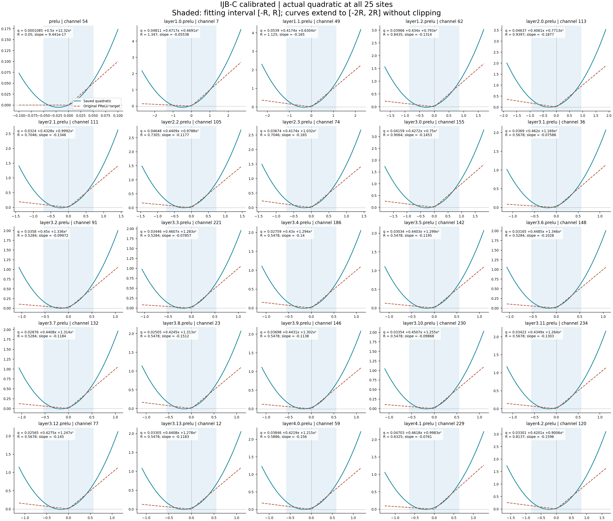
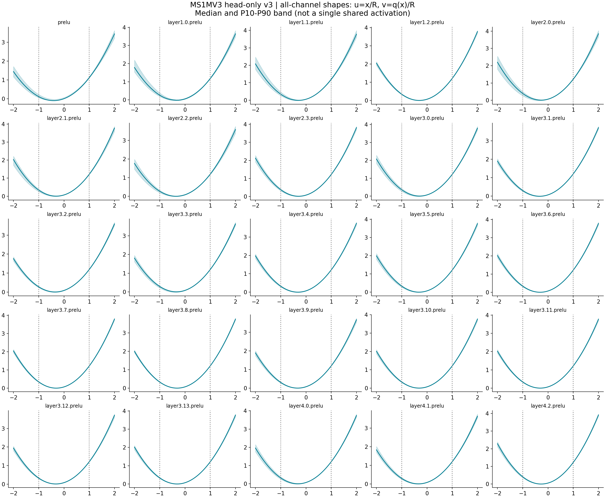
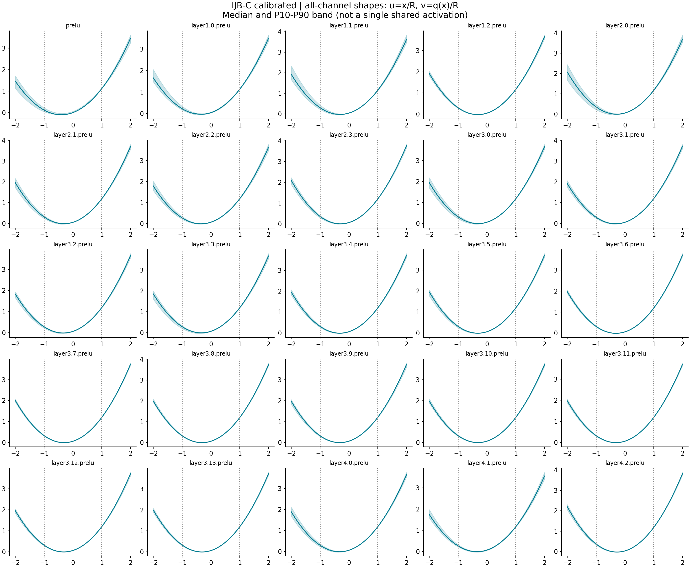

# 2026-09-15：全 PReLU 替換為無 clipping 二次式的 iResNet50 結果

## 結論與比較範圍

以 **IJBC TAR@FAR=10⁻⁴** 排名，固定同一 checkpoint 再列出其他 FAR 的表現；不是在每個 FAR 各挑一個模型。
本次依你的指示排除 `work_dirs/student_best.pt`。

- **有 IJBC 校準：`channelwise_template_supervised01_20260915`，96.0628%。** 25 個 activation sites 全為 per-channel 二次式，推論沒有 clipping；完整 938,750 次原圖／翻轉的 module input/output 與 embedding 均沒有 non-finite。最後一階段使用 IJBC 官方配對標籤，這是 **IJBC 校準集表現**。
- **無 IJBC 校準：可由現有訓練設定與零 non-finite 評估紀錄支持的最佳候選是 `controlled_degree2_accuracy_recovery_head_only_v3_20260908`，**93.4243%**（歷史表四捨五入為 93.42%）。** 它的梯度訓練資料為 MS1MV3，最後用 LFW canary 選 checkpoint，IJBC 評估紀錄為 0 個 non-finite augmented embedding rows。舊 evaluator 沒有保存新版逐 module 完整 finite audit，因此不能把其證據範圍寫成與新版模型相同。

這裡的「無 IJBC 校準」指這條可查證的訓練／微調鏈未拿 IJBC 圖片、標籤或 tail replay 做參數校準。初始區間沿用 run10 的 buffers，而 run10 歷史曾依 **IJB-B** escape 診斷調整區間；IJB-B 與 IJB-C 有樣本重疊。因此它也不適合稱為嚴格 IJB 完全隔離的測試。從歷史 IJBC 結果選出「目前最好」本身也涉及事後比較，並非預先固定的獨立驗證。

補充：[PReLU → 全二次 → v7 的逐階段 non-finite／準確度變化](v7_lineage.md)，包含 v5 best／final 權重對應的更正。

## 1. TAR vs FAR 圖表

TAR 是真實同人配對被接受的比例；FAR 是不同人配對被錯誤接受的比例。所有 TAR 單位為 %。



主表採 **actual FAR ≤ requested FAR**：從儲存的 15,658,489 個 pair scores 重新計算 ROC，取不超過指定 FAR 的最高 TAR。沒有重跑影像推論。



第二張採既有 `eval_ijbc.py`／CSV 的 **nearest ROC point** 規則，方便與歷史表逐項核對。它有時會略超過指定 FAR；這是兩張表小幅差異的原因，不是換了 checkpoint。精確 TAR、actual FAR 與 threshold 均在 [tar_vs_far.csv](tar_vs_far.csv) 與 [metrics.json](metrics.json)。



PReLU baseline 僅作參考，不符合「全二次」篩選條件。有／無校準兩條路徑的初始化、訓練、區間及 head 都不同，所以兩者差距不能直接解讀為「只加 IJBC 校準」的因果提升。

### 為何不選其他看起來更高的模型？

- `narrow_guard_v4` epoch2：95.78%，但有 **13** 個 non-finite augmented rows。
- `controlled_direct_degree2` polish unclipped：95.68%，有 **14** 個。
- `tail_ms1mv3_20260907`：95.64%，有 **8** 個。
- `quadT12c`：95.62%，有 **193** 個。
- channelwise 主訓練 epoch14：95.54%，有 **9,712** 個；尚未經 IJBC 數值修復。
- `bn_contract_v14`：94.94%，有 **4** 個；`source_channel_v18`：94.89%，也有 **4** 個。
- `source_causal_v16` 是 finite，但 90.58% 低於 head-only v3。
- shared-D 雖然 finite 且約 96.06%，但保留 inference input bounds，排除。
- 舊 `layerwise_poly_group4_d2` 有 94.51% CSV，現有目錄只有 CSV/PDF，缺少該次 checkpoint 及完整 finite 評估證據，不能據此認定合格。
- run10 文件的 96.29% 是 **degree-4** 模型，排除。

上述 non-finite 結果的 evaluator 曾把壞特徵補成 0；這些 TAR 不列入合格排名。原始路徑與紀錄見 [selection_evidence.json](selection_evidence.json)。本結論限於目前 checkout 可查證、且已有完整 IJBC 結果的實驗。

## 2. 模型與訓練流程



兩個模型都是人臉辨識用 **iResNet50**，輸入 aligned RGB `[N,3,112,112]`、像素正規化到 [-1,1]，輸出 512 維 embedding；不是一般 ImageNet ResNet50。
25 個 PReLU sites = stem 1 + stage1 3 + stage2 4 + stage3 14 + stage4 3。共有 **5,888 個 channel-specific 二次式、17,664 個係數**，不是全網共用同一條拋物線。

### A. 無 IJBC 校準：head-only v3

**權重：** [student_best.pt](../../work_dirs/controlled_degree2_accuracy_recovery_head_only_v3_20260908/train/student_best.pt)。保存為 epoch **0**、step **2529**，即完成第一個 epoch 後選中的版本；不能把設定上限 4 epochs 說成最終模型訓練了 4 epochs。

可追溯的前置流程（以下 epoch 為各階段設定；完整設定見 [no_ijbc_training_chain.json](no_ijbc_training_chain.json)）：

1. 從原始 MS1MV3 PReLU teacher 初始化，在 **100,096** 張 MS1MV3 樣本上建立 activation histogram。借用 `poly_run10/model/student_best.pt` 的 fitting intervals，重新做 degree-2 擬合，不沿用 degree-4 activation。
2. `tail_ms1mv3_20260907/progressive`：8 epochs 設定，依序替換；swap 2 epochs，ramp 2 epochs，teacher embedding／stage hints／range 與 causal-tail 損失。
3. 同系列 polish：3 epochs；`lam4/polish` 再 3 epochs，擴展 fitting interval（scale=4）；`refine125` 再 3 epochs，加強 MS1MV3 tail 控制（causal-tail weight=2、layer3 interval 再乘 1.25）。
4. head-only v3 從 `refine125/student_final.pt` 啟動。凍結 stem、layer1–4 的參數且保持 eval behavior，二次係數因此也凍結；只更新後段 embedding head 的可訓練部分。用 teacher cosine embedding distillation 恢復辨識特徵，最後以 LFW canary 選出第一個 epoch checkpoint。

最後階段：SGD + Nesterov、momentum .9、weight decay .0005；global batch 2048（4 ranks × 128 × gradient accumulation 4），BF16，實際基礎 LR .0008，warmup .5 epoch 後 cosine schedule。低解析度、光度、crop augmentation 各 .05，最後階段沒有 tail replay、stage hint 或 range penalty。精確設定：[head_training_config.json](head_training_config.json)。

**無 clipping 指部署推論。** 前置轉換／tail 訓練可用暫時的 bound 或 straight-through 數值輔助；不把這些 training-only 操作算作部署 activation。最後 head-only 的凍結 backbone 使用 eval 行為。

### B. 有 IJBC 校準：supervised01

**權重：** [evaluated_checkpoint.pt](../../work_dirs/channelwise_template_supervised01_20260915/ijbc_full/evaluated_checkpoint.pt)。SHA-256：`64e3e65555638cbe43d93f104a9d8e913346bab070e4538cebf950479fb3fddf`。

1. **重新初始化與擬合。** 只從 `work_dirs/ms1mv3_r50/model.pt` 的 PReLU teacher 出發；用 100,000 MS1MV3 圖片，逐 channel 的絕對輸入 99.95th percentile histogram 上緣乘 1.5，最小半徑 .05。weighted least squares 加 5% uniform edge weight，初始 regularization radius=.6R。
2. **有身分監督的主訓練。** Frozen teacher 與 BN running statistics；更新 Conv、BN affine、ArcFace classification head 及 polynomial coefficients。16 H200、FP32、global batch 2048；backbone/head/coefficient LR 分別 .001/.005/.00002。設定為 head warmup 1 epoch、25 sites 分 12.5 epochs 依序轉換、總上限 24 epochs。
3. **實際經歷數值失敗與續訓。** 原始排程不是一次成功跑滿 24 epochs。後續設定關閉 pathological/stress augmentation，加入 training prefix guard=4R、repair target=2R；在超界時改用有限前綴修復。最終來源是全二次的 **epoch14 snapshot**。此 snapshot 在完整 IJBC 有 9,712 個壞 embedding，尚不能採用。
4. **IJBC 數值修復與 teacher distillation。** 從失敗 manifest 重播原圖／翻轉，同時抽樣 IJBC 圖片。先使用帶暫時 bound 的輔助圖與無 clipping 有限前綴 loss，再加 exact-unclipped cosine KD；逐步處理剩餘 110→21→6 個尾端失敗。BN moments／區間 buffers 固定。這些 bound 都不在最終推論圖中。
5. **Exact head KD 與 image-pair geometry。** exact-head mse0 用 cosine KD、2,000 steps、LR .003，只調 head；再以 affine head 的 pair-cosine geometry loss 校準 2,000 steps、LR 1e-4。詳細每一段 steps、LR、來源 hash 見 [calibrated_training_chain.json](calibrated_training_chain.json)。
6. **完整 template、有標籤校準。** 4,096 fitting templates、2,048 validation templates，split seed=20260927。固定 630 組正配對、629 組初始 source cosine≥.2 的負配對，兩端都限 fitting partition。Adam、2,000 steps、LR 1e-4、seed=20260926，僅優化 affine head，選中 step 2000。以 validation teacher geometry 選模，不用 validation pair labels；但最終全 IJBC 評估包含 fitting templates，因此仍屬校準集表現。
7. **Fold affine head、導出與完整評估。** affine mapping 併入既有 linear layer；BN 折疊為固定 scale/offset。完整 469,375 張原始影像、938,750 個 original/flip embedding，包含 766-row remainder，112 個受稽核 module boundaries 均零 non-finite。實際 GPU 導出圖保存在 [polynomial_certificate.pt](../../work_dirs/channelwise_template_supervised01_20260915/ijbc_full/polynomial_certificate.pt)，CPU 重新 fold 的 BN 可能有微小舍入差，重現應保留實際評估 bytes。

## 3. Loss functions

### 共用概念：蒸餾與範圍限制

令 teacher/student embedding 為 t、s：

\[
L_{cos}=\frac1N\sum_i\left(1-\frac{s_i^Tt_i}{\|s_i\|\|t_i\|}\right).
\]

它讓 student 的向量方向接近 teacher，不是直接擬合每一個座標。stage hints 則讓中間 feature maps 也靠近 teacher。

Controlled trainer 的 hint 是各 stage `MSE(S,T)/(Var(T)+1e-6)` 的平均。範圍項使用 activation **進入二次式之前**的輸入 x：

\[
L_{range}=\frac1{25}\sum_\ell\frac1N\sum_{i,c,h,w}
\left[\max\left(\frac{|x_{\ell,i,c,h,w}|}{\lambda_{reg,\ell,c}}-1,0\right)\right]^2.
\]

超界才罰；不是在推論時截斷 x。causal-tail loss 另對指定層／高 tail 樣本的最大超界施壓，讓早期造成爆炸的輸入先縮回去。

### A. head-only v3 的最終 loss

\[
\boxed{L_A=5L_{cos}.}
\]

最後這段 **沒有 ArcFace／AdaFace 分類 loss**。hint、range、causal-tail、operator-bound 權重都為 0。SGD weight decay 是 optimizer 的額外正則化。前置訓練才是 `L_cos + h(t)L_hint + beta(t)L_range + w_tail L_causal + w_op L_operator`；hint 從 1→.3，range weight ramp 到 1，causal-tail 依階段為 1 或 2；refine125 另有 .001 倍 operator-bound penalty，抑制 convolution row Frobenius norm 超過來源值加 .05 margin。

### B. channelwise 主訓練

\[
L_{main}=L_{ArcFace}+L_{cos}+h(p)L_{hint}+\beta(p)L_{boundary}.
\]

`h(p)=.3(1-p/E)`，`beta(p)=range_weight·min(1,(p+.05)/2)`。這個 trainer 的 hints 用逐樣本 `mean((S-T)^2)/max(mean(T^2),1e-6)`，與上面的 controlled trainer 正規化不同。boundary 平均各層的元素平均超界損失，另加 .01 倍逐樣本最大超界；guarded repair batch 走另設的有限前綴修復分支，不應把全部更新都說成標準 classification batch。

ArcFace 對正確身分的 cosine logit 加 angular margin：

\[
L_{ArcFace}=-\frac1N\sum_i\log\frac{e^{64\phi(\theta_{i,y_i})}}
{e^{64\phi(\theta_{i,y_i})}+\sum_{j\ne y_i}e^{64\cos\theta_{i,j}}},
\quad m(p)=.5\min(1,p+.1).
\]

通常 `phi=cos(theta+m)`；程式在 `cos(theta)≤cos(pi-m)` 使用 `cos(theta)-sin(pi-m)m` 的 monotonic fallback。classification head 在訓練用到 normalization、sqrt、branch 與 softmax，**不在部署 backbone 裡**。

### B. IJBC 數值修復與最終 template loss

數值修復是多階段，不是只加一個 classification loss：

\[
L_{repair}=w_{aux}(L_{cos}^{bounded}+.3L_{hint}^{bounded}
+w_rL_{range}^{bounded})+w_rL_{prefix}+w_{exact}L_{cos}^{unclipped}.
\]

初始 `w_exact=0`，後來加到 5；exact-head mse0 則 `w_aux=w_r=0, w_exact=1`。實際參數按各階段 config。auxiliary bound 是為了求出有限訓練梯度，最終 graph 不保留它。

最後 template 階段，令未正規化的 source template aggregation 為 v_i，head 為 A,b，聚合的 bias weight 為 w_i：`z_i=A v_i+w_i b`。不是每個未正規化 template sum 都只加一次 b；w_i 包含 original/flip、detector score、media aggregation 權重。實作 cache 已除以 w_i 成為 barycenter，因此優化時直接算 `A(v_i/w_i)+b`，方向與上式相同。
令 `s_ij=cos(z_i,z_j)`、teacher cosine 為 `t_ij`，固定高相似集合 H 為 teacher 或初始 source cosine≥.2 的有效不同 template 配對：

\[
L_{geometry}=\operatorname{mean}_{i\ne j}(s_{ij}-t_{ij})^2
+\operatorname{mean}_{(i,j)\in H}(s_{ij}-t_{ij})^2,
\]

\[
L_{sup}=\operatorname{mean}_{P}[\max(.4-s_{ij},0)]^2
+\operatorname{mean}_{N}[\max(s_{ij}-.2,0)]^2,
\]

\[
\boxed{L_{final}=L_{geometry}+.01L_{cos}(z,t)
+.001\frac{\|A-I\|_F^2+\|b\|_2^2}{512}+.01L_{sup}.}
\]

正負配對各自取平均後相加，沒有額外除以 2。正配對推向 cosine≥.4、負配對推向≤.2；.4/.2 是 **訓練 margin，不是 IJBC 測試 threshold**。

## 4. 實際二次式長什麼樣？

\[
q_{\ell,c}(x)=c_{0,\ell,c}+c_{1,\ell,c}x+c_{2,\ell,c}x^2,
\quad f_{\ell,c}(x)=\begin{cases}x&x\ge0\\a_{\ell,c}x&x<0.\end{cases}
\]

初始化的 approximation target 是各 channel 的原始 PReLU `f`，擬合區間是 **[-lam_fit, +lam_fit]**。保存的 fitting 半徑：無 IJBC 模型全 channel 為 **0.224575–10.343824**，有 IJBC 模型為 **0.050000–2.765135**；兩者都使用逐 channel 區間，不能套同一個全域 R。

`lam_reg` 是訓練處罰開始的位置，不是 fitting interval，也不是 inference clamp。有校準模型之後聯合更新係數，目標轉為整體辨識、teacher fidelity 與數值穩定，曲線因此不必一直貼著最初的 PReLU。

### 無 IJBC 校準模型



### 有 IJBC 校準模型



每個 panel 從該層取 **lam_fit 排序中位位置的真實 channel**，標出實際 c0/c1/c2 與原 PReLU slope。藍線是保存的二次式，橘色虛線是原始 PReLU，底色是該 channel 的 fitting interval。畫到 ±2R，讓沒有 clipping 的外插行為可見；不是憑空選一組「示意係數」，也不是把不同 channel 的係數中位數拼成不存在的 activation。

二次式是平滑拋物線，沒有 PReLU 在 0 的折角；c2>0 開口向上，c2<0 開口向下，頂點為 `-c1/(2c2)`。跨層／channel 的 R 與曲率不同，不能用一條 `ax²+bx+c` 代表整網。

全 channel 的形狀另以 `u=x/R, v=q(x)/R` 正規化，避免單純因區間尺度不同產生誤解：





實線為 channel median，色帶為 P10–P90，並非全部 channel 的包絡或誤差信賴區間。每個 channel 的原始係數、區間與 target slope 均在 [coefficients.csv](coefficients.csv)。這些圖的 x 範圍是展示／擬合範圍，**不是 IJBC 實測 activation distribution**；finite audit 只證明受測樣本數值有限，不保證都在 fitting interval，也不保證任意輸入不爆炸。

### FHE 含義

每個二次 activation 只需要一次 `x*x`；最深路徑有 25 層這樣的非線性乘法深度，尚未包含 affine 的實作成本。BN 可折成常數 affine、沒有 activation clipping；但平方會放大超區間尾端，所以低 degree 本身不代表數值安全。L2 normalization、media/template 聚合與 cosine scoring 都在此 polynomial backbone 的加密路徑範圍之外；本報告沒有宣稱整套 IJBC pipeline 已全 FHE 化，也沒有量測 CKKS 噪聲／耗時。

## 5. 證據與重建

- [校準模型來源鏈與參數](calibrated_training_chain.json)，對應 [既有完成紀錄](../experiments/channelwise_ijbc96_completed.md)。
- [無 IJBC 訓練設定鏈](no_ijbc_training_chain.json)、[篩選與 finite 證據](selection_evidence.json)。
- [本次驗證結果](validation.json)：ROC／CSV、finite 紀錄、checkpoint hash、圖片與文件連結均通過。
- [精確 metrics／checkpoint 及 score hashes](metrics.json)、[TAR CSV](tar_vs_far.csv)、[實際係數 CSV](coefficients.csv)。
- 實作：[controlled losses](../../controlled_degree2/losses.py)、[controlled trainer](../../controlled_degree2/train.py)、[ArcFace 主訓練](../../controlled_degree2/recipe_a.py)、[數值校準](../../controlled_degree2/calibrate_ijbc_channelwise.py)、[template 校準](../../controlled_degree2/calibrate_pair_geometry.py)、[supervised loss](../../controlled_degree2/supervised_template_pairs.py)。

Python 圖形全部使用 Matplotlib，所有輸出在本目錄。重建：

```bash
OPENBLAS_NUM_THREADS=1 OMP_NUM_THREADS=1 \
/home/u8798807/.conda/envs/face_recog/bin/python docs/0915_result/generate_figures.py
```

僅讀 checkpoint／既有 scores、在 CPU 重算 ROC 與畫圖；不啟動訓練或全資料影像推論。程式會核對 pair 數量、score finite、與原始 CSV 的逐點一致性，以及每個模型 25 sites／5,888 channels／每個 c2 非零。
