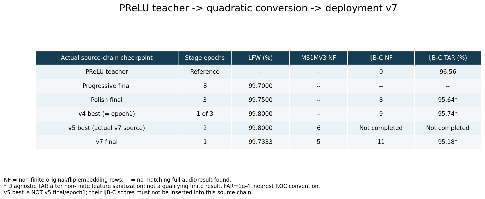

# PReLU → 全二次轉換 → deployment v7：數值穩定與辨識變化

## 先更正 v5 的來源對應

先前對話把「v5 的 IJBC 有 4 個 non-finite」直接當成 v7 的來源表現，這個對應不成立。

v5 的兩份訓練紀錄（358335、358337）使用相同輸出目錄。現存 `student_best.pt` 為 epoch=1、step=5058、LFW=99.80%；現存 `student_final.pt` 的 best-canary=99.75%，其訓練紀錄最後 LFW=99.7167%。直接比對 state_dict，best 與 final 有 **370 個不同 tensors**，best 與 `student_epoch1.pt` 有 **449 個不同 tensors**。

v7 的 config 與 MS1MV3 mining manifest 都指向 **v5/student_best.pt**。該路徑的 IJBC job **358339 被取消**，log 只到 batch9，沒有完整 TAR。不能把另一份 v5 final 或 epoch1 的「4 個」移植進來源鏈。

## 實際來源鏈



- IJBC TAR 為 **FAR=1e-4、nearest ROC point**，與舊 CSV 相同。PReLU 的該規則為 96.56%；若採 actual FAR≤1e-4，則為 96.5537%。
- NF 計算 **original/flip embedding rows**，不是 scalar NaN/Inf 數，也不是一律等於來源圖片數。
- IJBC 完整評估為 469,375 張／938,750 個 original+flip rows；MS1MV3 audit 為 5,179,510 張、含兩方向。
- `--` 表示找不到對應 checkpoint 的完整資料，不能解讀為 0。
- LFW 是各 checkpoint 所在 epoch 的 canary accuracy，不可与 IJBC TAR 混為同一種 accuracy。
- 帶 `*` 的 IJBC TAR 是 non-finite 特徵補零後的診斷值，均不符合零 non-finite 合格條件。

### 各階段解讀

1. **PReLU teacher**：IJBC zero non-finite，TAR 96.56%。它是參考模型，尚未做全二次替換。
2. **Progressive final**：完成 8 epochs，LFW 99.70%。這份 final 接到 polish；未找到它單獨的完整 IJBC 評估，不能直接套用 polish 的結果。前兩個 epoch 仍在轉換，LFW 分別為 96.8833%、99.5667%，也不能把它們當全二次最終結果。
3. **Polish final**：再訓練 3 epochs，最後 LFW 99.75%；IJBC 8 個 non-finite、TAR 95.64%。polish 的最佳 LFW 曾是 epoch2 的 99.7833%，但下一階段載入的是 **final**，不是 best。
4. **narrow_guard_v4 best**：三個 epoch 中選第一個，LFW 99.80%；與 `student_epoch1.pt` 的 state_dict 完全一致，所以可對應 IJBC epoch1 的 **9 個／95.74%**。v4 epoch2 雖有 95.78%，但有 13 個 non-finite，且不是後續 v5 的來源，不能放在主鏈替代 best。
5. **causal_fixed_v5 best**：來源是 v4 best，現存 best 在第二個 epoch、LFW 99.80%；完整 MS1MV3 audit 有 **6 個** non-finite orientations。對應 IJBC best job 取消，無完整 TAR。
6. **deployment_v7 final**：從上述 v5 best 再做 1 epoch，LFW 99.7333%；完整 MS1MV3 仍有 **5 個** non-finite orientations，IJBC 有 **11 個／95.18%**。

因此可以確認：**來源链的改善並非單調。** v7 在 MS1MV3 將 6 個失敗變為 5 個，但不是「修好其中一個，其餘不變」：只有 source_index=1411164 的 original/flip 兩項仍相同，其餘失敗集合有更替。v7 也沒有通過完整 IJBC finite gate。由於 v5 best 的 IJBC 缺測，不能量化「從實際 v5 source 到 v7」的 IJBC 改善或惡化。

## 同系列可參考，但不屬於實際来源 checkpoint 的結果

- **v4 epoch2**：IJBC 13 個 non-finite、95.78%；v4 final：12 個、95.76%。
- **v5 epoch1**：IJBC 4 個、95.49%，是獨立保存的 epoch1 權重。
- **v5 final**：IJBC 4 個、95.53%，不是 v7 讀取的 best 權重。
- 因此先前「v5→v7，IJBC 4→11」只能描述 v5 另一份權重與 v7 的跨 checkpoint 比較，不能稱為直接來源前後比較。

後續 `candidate_093` 是 v7 final 的 `layer1.1.bn2` γ、β 乘 .93：MS1MV3 5→0，IJBC 11→4、TAR 95.18→94.94%。它在 v7 之後，未列入上圖的終點。

## 證據與重建

- [機器可讀結果、來源 CSV／log／manifest 路徑](v7_lineage.json)。
- [Slurm 評估提交命令與狀態](lineage_sources/evaluation_jobs.txt)：確認 polish 評估讀 final、v4 讀 epoch1，及 v5 best 被取消。
- [PReLU 完整 finite audit 摘要](../experiments/channelwise_ijbc96_verified_prelu_result.json)。
- [progressive／polish 訓練紀錄](../../work_dirs/controlled_degree2_tail_ms1mv3_20260907/slurm-354365.out)。
- [v4 訓練紀錄](../../work_dirs/controlled_degree2_tail_ms1mv3_narrow_guard_v4_20260908/slurm-357822.out)。
- [v5 第一份訓練紀錄](../../work_dirs/controlled_degree2_tail_ms1mv3_causal_fixed_v5_20260908/slurm-358335.out)、[第二份訓練紀錄](../../work_dirs/controlled_degree2_tail_ms1mv3_causal_fixed_v5_20260908/slurm-358337.out)。
- [v7 訓練紀錄](../../work_dirs/controlled_degree2_tail_ms1mv3_deployment_v7_20260908/slurm-358938.out)。

重建 PNG／JSON（CPU，只讀現存評估，不重跑模型）：

```bash
OPENBLAS_NUM_THREADS=1 /home/u8798807/.conda/envs/face_recog/bin/python docs/0915_result/generate_v7_lineage.py
```
